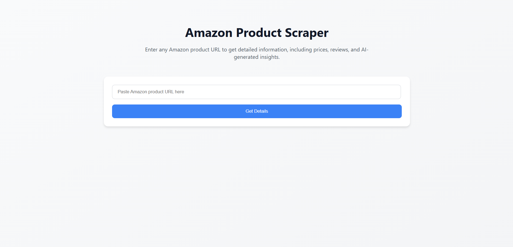
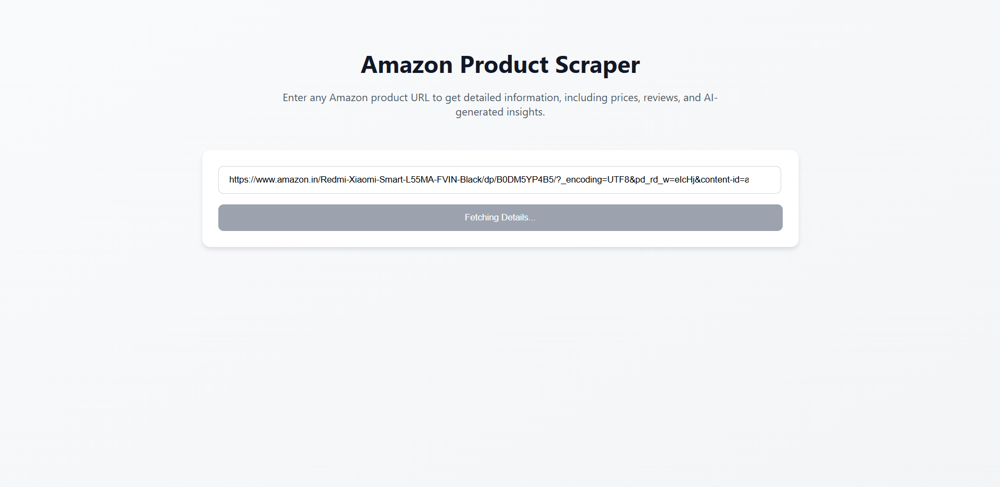
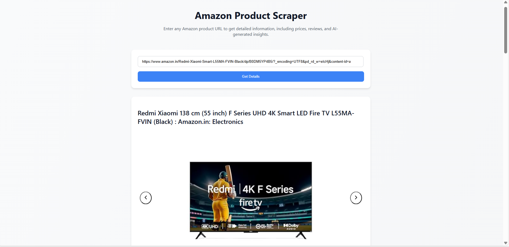
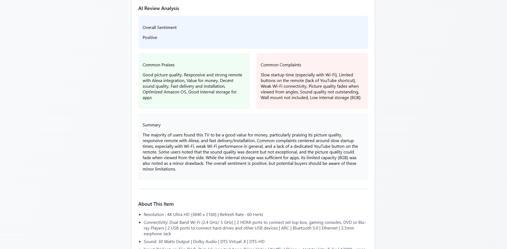
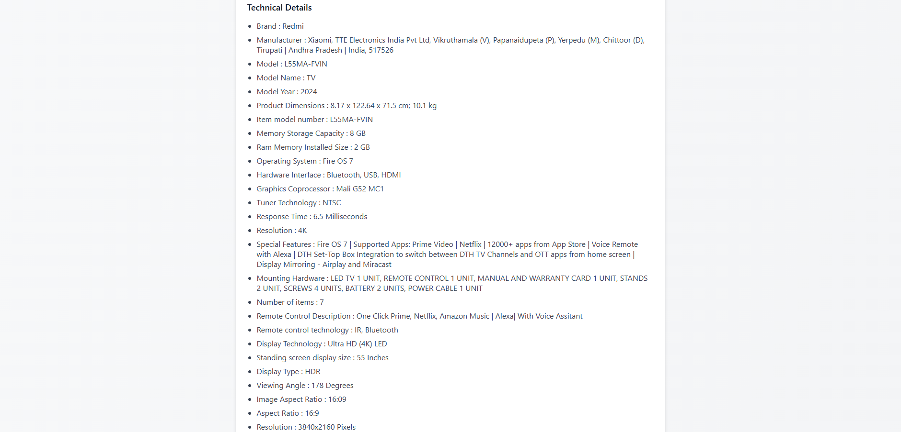

# Web Scraper with React Frontend

This project is a full-stack web scraping app with a **Node.js + Puppeteer backend** and a **React frontend**. The backend performs web scraping, and the frontend displays the extracted data.

## Features

-  Scrapes data using Puppeteer
-  Built with Node.js and TypeScript
-  Interactive UI built with React
-  Full-stack integration: scraping & display in one app

## Tech Stack

- **Frontend**: React + Vite + TypeScript
- **Backend**: Node.js + Puppeteer + Express
- **Others**: dotenv, Axios

## Installation

Clone the repository and install dependencies for both frontend and backend:

```bash
git clone https://github.com/your-username/webscraping.git
cd webscraping

# Install backend dependencies
cd backend
npm install

# Install frontend dependencies
cd ../frontend
npm install

```

## Start Backend
```bash
cd webscraping/backend
npm start
```

##  Start Frontend
```bash
cd webscraping/frontend
npm run dev
```

## Screenshots

### Homepage




### Response






